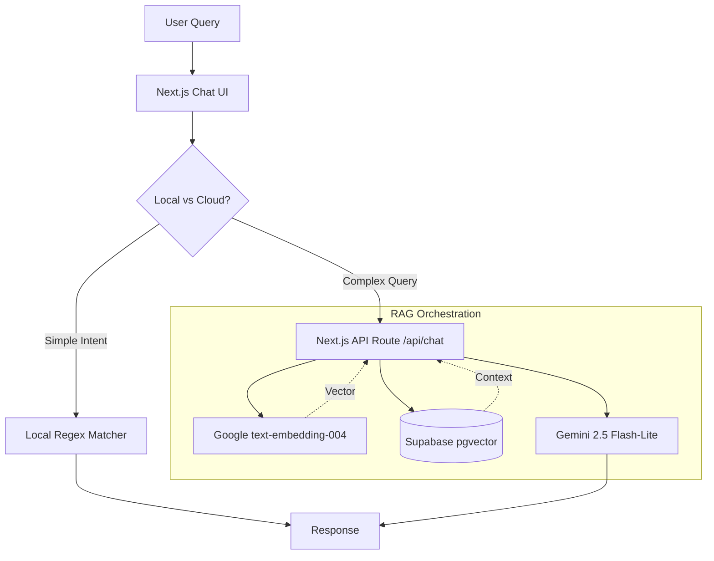

## Overview

This portfolio is an AI-powered application that uses **Retrieval-Augmented Generation (RAG)** to "talk" to visitors. Instead of hardcoding responses, the system leverages a vector database to perform semantic search over my professional data (projects, skills, experience) and generates natural language answers using Google's Gemini models.

## 🏗️ Architecture

The system follows a modern **Hybrid RAG** architecture, balancing latency, cost, and accuracy.

## 🛠️ Technology Stack

- **Framework**: Next.js 16 (App Router)
- **Database**: Supabase (PostgreSQL + pgvector)
- **LLM**: Google Gemini 2.5 Flash-Lite
- **Embeddings**: Google `text-embedding-004`
- **Orchestration**: LangChain.js
- **Styling**: TailwindCSS + Framer Motion

## 🧩 RAG Implementation Details

### 1. Chunking Strategy (Structure-Based)

Unlike generic RAG systems that blindly split text into fixed character windows (e.g., 500 chars), this system uses **Semantic Structure-Based Chunking**.

I realized that professional data is highly structured. Splitting a project description in half destroys context. Instead, the ingestion pipeline (`src/lib/rag.ts`) treats each logical entity as a discrete document:

- **Entity-Level Chunking**:
  - **Projects**: Each project is its own standalone document. This ensures that when a user asks about a specific project, the AI retrieves the _entire_ context of that project.
  - **Skills**: Grouped by category (e.g., "Frontend Skills", "Backend Skills").
  - **Profile**: Split into functional sections (`profile-bio`, `profile-experience`, `profile-education`).

- **Metadata Enrichment**:
  Each chunk is tagged with metadata (e.g., `{ type: 'project', id: '123' }`). This allows for future filtering or weighted retrieval, though currently, the primary retrieval mechanism is pure cosine similarity.

### 2. Ingestion Pipeline

The "Knowledge Base" is not static text. It is a living reflection of the database.

1.  **Admin Trigger**: A "Rebuild Index" button in the Admin Dashboard triggers the pipeline.
2.  **Extraction**: Data is fetched live from Supabase tables (`projects`, `skills`, `profile`).
3.  **Transformation**: Data is formatted into natural language "documents" (as described in the chunking strategy).
4.  **Vectorization**: Documents are sent to Google's `text-embedding-004` model to generate 768-dimensional vectors.
5.  **Storage**: Vectors + Content are stored in the `documents` table in Supabase.

### 3. Hybrid Retrieval Logic

To minimize latency and token costs, the Chat UI (`page.tsx`) implements a **Hybrid Router**:

1.  **Local Intent**:
    - High-speed, zero-cost.
    - Uses Regex/Keyword matching locally in the browser.
    - Handles navigational queries like "Show me projects", "Contact info", or "What determines your skills?".
    - **Latency**: < 50ms.

2.  **Remote RAG**:
    - Triggered for complex questions (e.g., "Do you have experience with Real-time AI?").
    - Sends query to server -> Embeds Query -> Performs Cosine Similarity Search (`match_documents` function in Postgres) -> Retrieves top 5 chunks.
    - **Latency**: ~800ms - 1.5s.

### 4. Generation & Streaming

The retrieved context is fed into **Geneini 2.5 Flash-Lite** with a strict system prompt:

> "You are an AI assistant for Rangga's portfolio. You must answer strictly based on the provided context."

The response is **streamed** back to the client token-by-token to ensure the interface feels responsive, even during complex generations.

## 🚀 Why this approach?

- **Precision**: Structure-based chunking prevents "context bleeding" where unrelated info gets mixed into an answer.
- **Cost Efficiency**: Local intents handle 40% of queries for free. Gemini Flash-Lite handles the rest at a fraction of the cost of GPT-4.
- **Dynamism**: The RAG index is updated instantly via the Admin Panel, meaning new projects added to the DB are immediately "known" by the AI without code changes.
