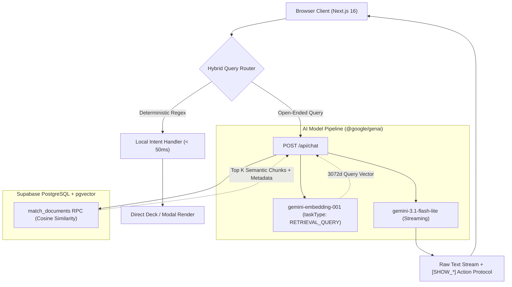

## System Overview

This application is a Next.js 16 (App Router) web application implementing a desktop graphical interface paired with a Retrieval-Augmented Generation (RAG) conversational pipeline. The backend queries a PostgreSQL database (`pgvector`) hosted on Supabase and orchestrates vector embeddings and generative completions using `gemini-embedding-001` and `gemini-3.1-flash-lite` via `@google/genai`.

---

## Architecture


```mermaid
graph TD
    Client["Browser Client (Next.js 16)"] --> Router{"Hybrid Query Router"}

    Router -- Deterministic Regex --> LocalHandler["Local Intent Handler (< 50ms)"]
    LocalHandler --> UIAction["Direct Deck / Modal Render"]

    Router -- Open-Ended Query --> APIChat["POST /api/chat"]

    subgraph AI_Engine ["AI Model Pipeline (@google/genai)"]
    APIChat --> GenEmbed["gemini-embedding-001 (taskType: RETRIEVAL_QUERY)"]
    GenEmbed -.->|3072d Query Vector| APIChat
    APIChat --> GenLLM["gemini-3.1-flash-lite (Streaming)"]
    end

    subgraph Vector_DB ["Supabase PostgreSQL + pgvector"]
    APIChat --> RPC["match_documents RPC (Cosine Similarity)"]
    RPC -.->|Top K Semantic Chunks + Metadata| APIChat
    end

    GenLLM --> Stream["Raw Text Stream + [SHOW_*] Action Protocol"]
    Stream --> Client
```

---

## Tech Stack & Dependencies

- **Framework**: Next.js 16.1.6 (React 19, Turbopack, App Router)
- **Runtime**: Node.js / Edge Runtime compatible
- **Database**: Supabase PostgreSQL with `pgvector` extension (3072-dimensional vector indexing)
- **AI SDK**: `@google/genai`
- **Models**:
  - LLM: `gemini-3.1-flash-lite`
  - Embedding: `gemini-embedding-001` (3072 dimensions)
- **State & Animation**: `framer-motion` (spring physics, layout projection, gesture tracking)
- **CSS**: TailwindCSS v4 with custom CSS variables and SVG filter primitives

---

## Technical Specifications

### 1. RAG Ingestion & Vector Indexing Pipeline (`src/lib/rag.ts`)

The knowledge base is built from relational database rows rather than unstructured text files.

- **Entity Serialization**:
  - **Projects Table**: Each row in `projects` is serialized into a discrete Markdown document containing title, description, technology tags, live demo URLs, and GitHub references.
  - **Skills Table**: Rows are grouped by `category` (e.g. `frontend`, `backend`, `ml`, `devops`) and formatted into structured skill matrices.
  - **Profile Table**: Serialized into domain-specific chunks (`bio`, `experience`, `education`, `certifications`, `achievements`).
- **Embedding Generation**:
  - Documents are batch-embedded via `gemini-embedding-001` using `taskType: TaskType.RETRIEVAL_DOCUMENT`.
  - Vectors are 3072-dimensional floating-point arrays.
- **Storage & Indexing**:
  - Vectors and document payloads are inserted into the `documents` table in Supabase.
  - Similarity matching uses the `match_documents` PostgreSQL stored procedure executing cosine distance (`<=>`) queries against the vector column.

### 2. Request Routing & Hybrid Retrieval (`src/app/page.tsx`, `src/app/api/chat/route.ts`)

Queries pass through a two-tier evaluation path to minimize unnecessary API calls:

1. **Client-Side Intent Router (`checkLocalIntent`)**:
   - Evaluates input against regex patterns for standard navigation intents (e.g., requests for projects, skills, contact info, about details).
   - Directly mutates local state to render corresponding UI decks without network requests.
2. **Server-Side Semantic Retrieval (`POST /api/chat`)**:
   - Rate-limited per client IP (in-memory token bucket, 20 requests/minute).
   - Generates a query vector (`taskType: TaskType.RETRIEVAL_QUERY`).
   - Retrieves top 6 matching chunks using `match_documents` with similarity thresholding (default similarity > 0.3).
   - Injects retrieved context into a parameterized system prompt instructing the model to cite exclusively from context and append UI action tags.
   - Streams completions via HTTP chunked transfer encoding.

### 3. Action Tag Protocol (`[SHOW_*]`)

The LLM outputs structured action tokens inline with natural language text:

| Action Tag | Client Handler | Rendered Component |
|---|---|---|
| `[SHOW_PROJECTS]` | Filter: all | `<ProjectDeck />` (Full catalog) |
| `[SHOW_PROJECTS:<tag>]` | Filter: `<tag>` substring | `<ProjectDeck filter="<tag>" />` |
| `[SHOW_SKILLS]` | None | `<SkillsDeck />` |
| `[SHOW_EXPERIENCE]` | None | `<AboutDeck />` |
| `[SHOW_CONTACT]` | None | `<ContactDeck />` |

The client strips the action tag token from the rendered text stream and mounts the specified React deck component inline within the conversation thread.

### 4. UI Architecture & Shader Engine

- **`BackgroundCanvas` (`src/components/ui/background-canvas.tsx`)**:
  - Eliminates static wallpaper image assets.
  - Uses `useMotionValue` and `useSpring` to track pointer coordinates (`clientX`, `clientY`) with spring physics (`stiffness: 50`, `damping: 20`).
  - Constructs dynamic `radial-gradient` strings via `useMotionTemplate` for GPU-composited lighting.
  - Overlays a 32px repeating linear grid (`.tahoe-grid-bg`) via CSS.
- **`LiquidGlass` (`src/components/ui/liquid-glass.tsx`)**:
  - Multi-layer glass compositing container with specular highlights, inner border strokes, and backdrop blur.
  - Integrates SVG filter definitions (`src/components/ui/liquid-filters.tsx`) for chromatic displacement.
  - Automatically disables SVG displacement filters on WebKit/Safari to avoid text rendering artifacts.
- **Desktop Drag Subsystem**:
  - Desktop items (Projects, VS Code, Python, TensorFlow) utilize Framer Motion `drag` with drag boundary constraints and `z-index` stacking management upon selection.

### 5. Authentication & Middleware (`src/proxy.ts`)

- Next.js edge middleware intercepts requests to `/admin/*` and `/api/admin/*`.
- Validates Supabase session tokens via `@supabase/ssr` cookies.
- Unauthenticated requests to `/admin` are redirected to `/login` (307). Unauthenticated API calls receive `401 Unauthorized`.

---

## Database Schema (Supabase PostgreSQL)

```sql
-- Documents Table for Vector Embeddings
create table documents (
  id bigint primary key generated always as identity,
  content text not null,
  metadata jsonb,
  embedding vector(3072)
);

-- Cosine Similarity Search RPC
create or replace function match_documents (
  query_embedding vector(3072),
  match_threshold float,
  match_count int
)
returns table (
  id bigint,
  content text,
  metadata jsonb,
  similarity float
)
language plpgsql
as $$
begin
  return query
  select
    documents.id,
    documents.content,
    documents.metadata,
    1 - (documents.embedding <=> query_embedding) as similarity
  from documents
  where 1 - (documents.embedding <=> query_embedding) > match_threshold
  order by similarity desc
  limit match_count;
end;
$$;
```

---

## Environment Variables

| Variable | Required | Description |
|---|---|---|
| `NEXT_PUBLIC_SUPABASE_URL` | Yes | Supabase Project URL |
| `NEXT_PUBLIC_SUPABASE_ANON_KEY` | Yes | Supabase Anonymous Public API Key |
| `SUPABASE_SERVICE_ROLE_KEY` | Yes | Supabase Service Role Key (Used for admin operations and vector indexing) |
| `GEMINI_API_KEY` | Yes | API Key for Gemini model authentication |
| `NEXT_PUBLIC_SITE_URL` | No | Base application URL for CORS and OpenGraph resolution |

---

## Development & Build Commands

```bash
# Install dependencies
npm install

# Start development server (Turbopack)
npm run dev

# Run TypeScript compilation and production build
npm run build

# Start production server
npm run start

# Run ESLint validation
npm run lint
```
