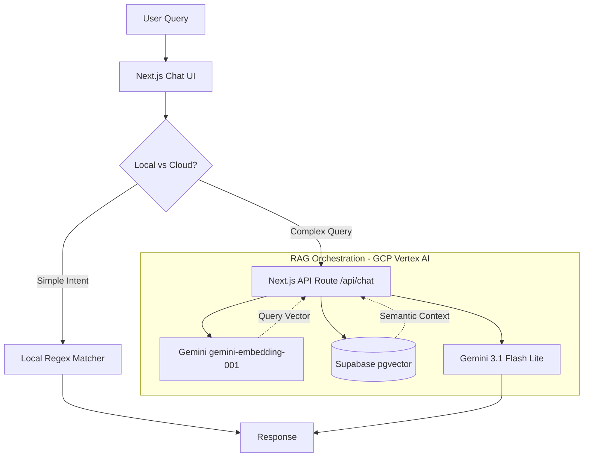

## Overview

This portfolio is an interactive, AI-powered portfolio that uses **Retrieval-Augmented Generation (RAG)** to answer questions about projects, skills, and experience. Built with an interactive UI and a vector-backed AI assistant, visitors can explore projects, skills, and background information through interactive cards and decks, or ask questions directly using natural language backed by Google Cloud Vertex AI / Gemini 3.1 Flash Lite and Supabase pgvector.

## Architecture

The system follows a modern **Hybrid RAG & Action Protocol** architecture, balancing sub-50ms interaction latency, token cost efficiency, and generative precision.

```mermaid
graph TD
    User["User Query"] --> Frontend["Next.js Chat UI"]
    Frontend --> HybridRouter{"Local vs Cloud?"}

    HybridRouter -- Simple Intent --> Local["Local Regex Matcher"]
    Local --> Response["Response"]

    HybridRouter -- Complex Query --> API["Next.js API Route /api/chat"]

    subgraph RAG_Orchestration ["RAG Orchestration - GCP Vertex AI"]
    API --> Embed["Gemini gemini-embedding-001"]
    Embed -.->|Query Vector| API
    API --> VectorDB[("Supabase pgvector")]
    VectorDB -.->|Semantic Context| API
    API --> LLM["Gemini 3.1 Flash Lite"]
    end

    LLM --> Response
```

## Technology Stack

- **Framework**: Next.js 16 (App Router, React 19, Server & Client Components)
- **Styling & UI**: Tailwind CSS v4, Framer Motion, dynamic background canvas, glassmorphism UI components
- **Language**: TypeScript 5
- **Motion Engine**: Framer Motion 12, custom animation presets (`src/lib/ease.ts`), `TextReveal`
- **Database & Vector Store**: Supabase (PostgreSQL with `pgvector` extension)
- **LLM / AI Engine**: Google Cloud Platform (GCP) Vertex AI / Google AI Studio (`gemini-3.1-flash-lite`)
- **Embeddings**: Google Cloud `gemini-embedding-001` (via `@google/genai`, 3072 dimensions)
- **Orchestration**: Google Gen AI SDK (`@google/genai`), LangChain, Next.js Edge Middleware & Server Route Handlers
- **Content Rendering**: React Markdown

## RAG Implementation Details

### 1. Chunking Strategy (Structure-Based)

Unlike generic RAG systems that blindly split text into fixed character windows, this system uses **Semantic Structure-Based Chunking**.

Professional portfolio data is highly structured: breaking a project description or an employment record in half destroys relational meaning. The ingestion pipeline (`src/lib/rag.ts`) treats each logical database record as a discrete semantic document:

- **Entity-Level Chunking**:
  - **Projects**: Each project is serialized as an independent document containing its title, featured flag, category, narrative description, tech stack tags, and demo/repo URLs.
  - **Skills**: Grouped by domain category into comparative matrices (e.g., `Skills in Frontend: React (90%), Next.js (85%)`) to maintain holistic context.
  - **Profile Sections**: Divided into dedicated documents (`profile-bio`, `profile-contact`, `profile-experience`, `profile-education`, `profile-certifications`, `profile-achievements`, `profile-custom`).
  - **Keyword Enrichment**: Educational chunks are enriched with targeted lexical markers (e.g., distinguishing `University Degree Study Academic` from `Bootcamp Course Workshop Cohort`) to dramatically boost cosine similarity recall on natural language queries.

- **Metadata Enrichment**:
  Each chunk is tagged with structured metadata (e.g., `{ type: 'project', id: '123' }` or `{ type: 'profile-education' }`) stored in a JSONB column alongside the embedding vector, enabling targeted filtering and contextual verification.

### 2. Ingestion Pipeline

The "Knowledge Base" is not static text. It is a living reflection of the database.

1.  **Admin Trigger**: A "Rebuild Index" button in the Admin Dashboard triggers the pipeline.
2.  **Extraction**: Data is fetched live from Supabase tables (`projects`, `skills`, `profile`).
3.  **Transformation**: Data is formatted into natural language "documents" (as described in the chunking strategy).
4.  **Vectorization**: Documents are sent to Google Cloud's `gemini-embedding-001` model with task type `RETRIEVAL_DOCUMENT` to generate dense semantic vector representations (3072 dimensions).
5.  **Storage**: Vectors + Content are stored in the `documents` table in Supabase pgvector.

### 3. Hybrid Retrieval Logic & Action Tag Protocol

To minimize latency and token consumption, the Chat UI (`page.tsx`) implements a **Hybrid Router** paired with an **Action Tag Protocol**:

1. **Local Intent Router**:
   - High-speed, zero network cost.
   - Evaluates user queries against regex and keyword patterns for greetings and standard navigational intents (projects, skills, about, contact).
   - Instantly opens the corresponding interactive deck or conversational greeting.
   - **Latency**: < 50ms.

2. **Remote Semantic RAG**:
   - Triggered for exploratory and nuanced questions (e.g., *"What experience do you have with real-time AI and WebSockets?"*).
   - Evaluates in-memory rate limiting (20 req/min) and origin security in `POST /api/chat`.
   - Embeds the query via `gemini-embedding-001` (`taskType: "RETRIEVAL_QUERY"`).
   - Executes the PostgreSQL stored procedure `match_documents` to find the top 6 most relevant chunks using cosine similarity (`1 - (documents.embedding <=> query_embedding)` with a similarity threshold of 0.2).
   - Includes automatic graceful fallback to table queries if vector RPC encounters downtime.
   - **Latency**: ~300ms - 800ms.

3. **UI Action Tag Protocol (`[SHOW_*]`)**:
   - The LLM prompt instructs Gemini to append structured action tags when answers relate to specific evidence or sections:
     - `[SHOW_PROJECTS]` or `[SHOW_PROJECTS:keyword]` $\to$ Mounts `<ProjectDeck filter="keyword" />`
     - `[SHOW_SKILLS]` $\to$ Mounts `<SkillsDeck />`
     - `[SHOW_EXPERIENCE]` $\to$ Mounts `<AboutDeck />`
     - `[SHOW_EDUCATION]`, `[SHOW_CONTACT]`, `[SHOW_ABOUT]`, `[SHOW_ACHIEVEMENTS]`, `[SHOW_CERTIFICATIONS]`
   - The client strips the tag from displayed text and renders the rich React deck component directly within the conversation stream.

### 4. Generation & Streaming

The retrieved context is injected into **Gemini 3.1 Flash Lite** (`temperature: 0.2`) with a comprehensive system prompt enforcing:
- Strict adherence to retrieved context (zero hallucination of unlisted skills or experiences).
- Query classification strategies (confirming existing skills with proof, gracefully pivoting when a technology is absent).
- Emission of UI action tags.

Completions are streamed back to the client token-by-token over a raw HTTP chunked stream (`ReadableStream`), ensuring immediate visual responsiveness.

## Interface & Interaction Design

In addition to conversational RAG, the interface includes interactive elements and responsive animations:

- **Interactive Layout**: Draggable icons, quick action buttons, project shortcuts, and preview cards with double-click opening.
- **Dynamic Background Canvas (`src/components/ui/background-canvas.tsx`)**: Pointer-tracking lighting effects built with Framer Motion spring physics over a lightweight CSS grid.
- **Glassmorphism Components (`src/components/ui/glass-card.tsx`, `src/components/ui/liquid-glass.tsx`)**: Layered glass cards with blur effects and border styling.
- **Motion System (`src/lib/ease.ts`)**: Standardized easing curves and spring physics presets for fluid UI transitions.

## Key Features

- **Precision**: Structure-based semantic chunking prevents context bleeding and ensures exact context delivery for projects and skills.
- **Interactive UI**: Clean layout with interactive cards, draggable icons, and responsive transitions built with Tailwind CSS and Framer Motion.
- **Enterprise-Grade AI**: Powered by Google Gemini 3.1 Flash Lite with 3072-dimensional vector embeddings for high accuracy and fast responses.
- **Cost & Speed Efficiency**: Local intent routing handles common navigation queries in under 50ms at zero token cost; Gemini Flash answers complex synthesis queries in milliseconds.
- **Live Dynamism**: Supabase serves as the single source of truth, updated in real time via an authenticated admin CMS with instant vector reindexing.
